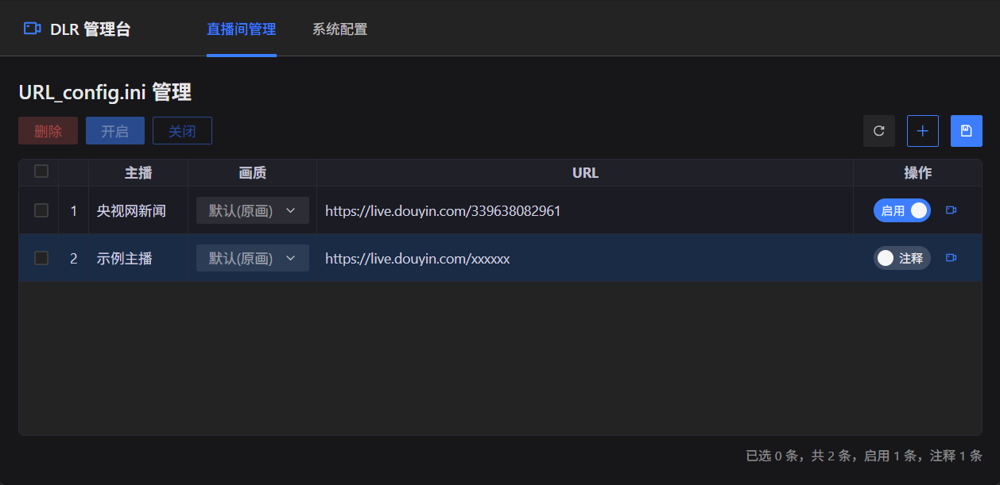
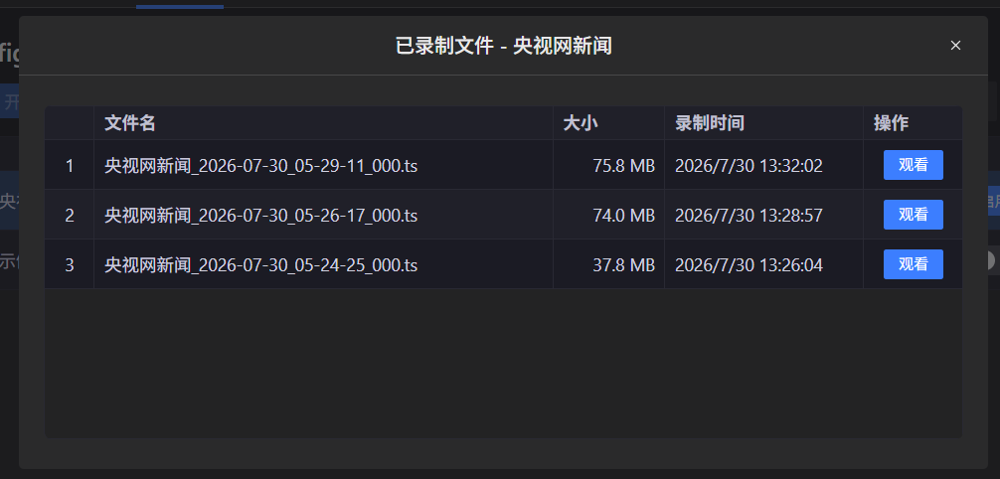
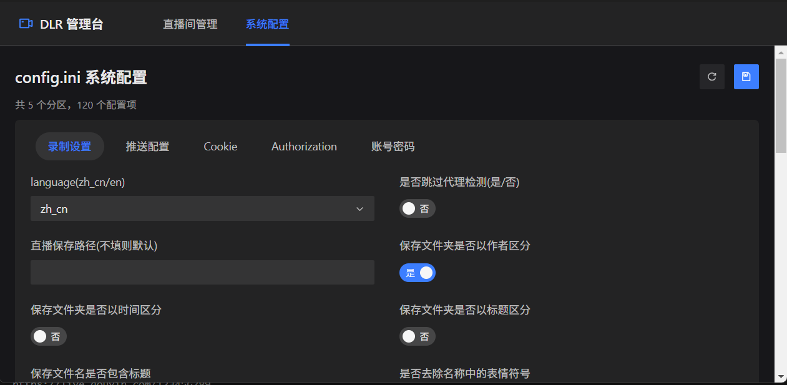

# DouyinLiveRecorderNode

基于 Node.js 实现的直播录制工具，源于 [ihmily/DouyinLiveRecorder](https://github.com/ihmily/DouyinLiveRecorder) 的 Node.js 移植版本。支持多平台直播的循环监测与自动录制，并内置 Web 配置管理台。

## 较原版新增的功能特性

- 🖥️ 内置 Web 配置管理台（Vue 3 + Fastify），可在线管理录制地址与配置
- ⚡ 实验性 Node 直录模式：FLV 直连流不经 ffmpeg 直接落盘

## 环境要求

- [Node.js](https://nodejs.org/) >= 18.0.0，或使用 [Bun](https://bun.com/)（兼容 Node.js，且内存占用更小，推荐）
- [FFmpeg](https://ffmpeg.org/download.html)（需加入系统 PATH，录制依赖）

## 快速开始

### 1. 安装依赖

```bash
npm install
# 或
pnpm install
# 或使用 bun
bun install
```

### 2. 添加录制地址

编辑 `config/URL_config.ini`，每行一个直播间地址，格式如下：

```ini
# 直接填地址（默认使用 config.ini 中的画质）
https://live.douyin.com/123456789

# 指定画质,地址
超清,https://live.douyin.com/123456789

# 画质,地址,备注（主播名会在首次录制时自动回写）
原画,https://live.douyin.com/123456789,主播: 某某

# 行首加 # 可临时停止监测该地址
#https://live.douyin.com/123456789
```

支持的画质：`原画`、`蓝光`、`超清`、`高清`、`标清`、`流畅`。

### 3. 启动

```bash
npm start
```

使用 Bun 运行（内存占用相比 Node 更小）：

```bash
bun main.js
```

启动后会自动开启循环监测，主播开播即自动录制。录制文件默认保存在 `downloads/` 目录下，按平台/主播分类存放。

## Web 配置管理台

程序启动时会自动运行 Web 配置管理台，访问地址：

```
http://127.0.0.1:5000
```

可在线完成：

- 录制地址的增删改、注释/取消注释
- `config.ini` 各项配置的可视化编辑
- 查看与回放已录制的视频

### 界面预览

**直播间管理**：管理 `URL_config.ini` 中的录制地址，支持批量删除/开启/关闭，单条启用或注释



**已录制文件**：查看每个直播间的录制文件列表，支持在线观看回放



**系统配置**：按分区可视化编辑 `config.ini` 全部配置项



也可以单独启动管理台（不启动录制）：

```bash
npm run config-manager
```

### 启用 HTTPS / HTTP/2

管理台默认以 HTTP/1.1 明文运行。如需启用 HTTP/2（浏览器要求必须搭配 TLS），编辑 `config-manager/config.js`：

```js
export default {
  enableHttp2: true,
  certPath: 'config/cert.pem',   // TLS 证书路径（相对项目根目录）
  keyPath: 'config/key.pem',     // TLS 私钥路径
};
```

#### 生成自签名证书

使用系统 openssl（Git Bash / Linux / macOS 自带）：

```bash
openssl req -x509 -newkey rsa:2048 \
  -keyout config/key.pem -out config/cert.pem \
  -days 365 -nodes -subj "//CN=localhost" \
  -addext "subjectAltName=DNS:localhost,IP:127.0.0.1"
```

> Windows CMD/PowerShell 中 `//CN=localhost` 改为 `/CN=localhost`。

生成后重启服务，使用 **https://** 访问：

```
https://127.0.0.1:5000
```

浏览器会提示"您的连接不是私密连接"（自签名证书不受信任），点击 **高级 → 继续前往** 即可正常使用。

#### 信任证书（可选，消除警告）

```bash
# Windows
certutil -addstore -user Root "config\cert.pem"

# macOS
sudo security add-trusted-cert -d -r trustRoot -k /Library/Keychains/System.keychain config/cert.pem

# Linux
sudo cp config/cert.pem /usr/local/share/ca-certificates/live-recorder.crt && sudo update-ca-certificates
```

#### 局域网访问

将 `host` 改为 `'0.0.0.0'` 并重新生成包含局域网 IP 的证书：

```js
// config-manager/config.js
host: '0.0.0.0',
```

```bash
openssl req -x509 -newkey rsa:2048 \
  -keyout config/key.pem -out config/cert.pem \
  -days 365 -nodes -subj "//CN=LiveRecorder" \
  -addext "subjectAltName=DNS:localhost,IP:127.0.0.1,IP:192.168.1.100"
```

将 `192.168.1.100` 替换为部署机器的实际局域网 IP。同时确保 Windows 防火墙放行端口 5000：

```powershell
New-NetFirewallRule -DisplayName "ConfigManager 5000" -Direction Inbound -Port 5000 -Protocol TCP -Action Allow
```

然后从其他机器访问 `https://192.168.1.100:5000`。

#### 注意事项

- 浏览器不支持明文 HTTP/2（h2c），`enableHttp2: true` 时必须同时配置有效证书，否则会自动回退为 HTTP/1.1
- 若未配置证书路径或证书文件不存在，服务会打印警告并回退为 HTTP/1.1 明文模式
- 启用 TLS 后会自动在 `port+1`（默认 5001）开放一个 HTTP 跳转端口，访问 `http://host:5001` 会自动 301 跳转到 HTTPS，可通过 `httpPort` 配置修改或设为 `-1` 禁用
- 配置变更后需重启服务生效

## 配置说明

主配置文件为 `config/config.ini`，常用配置项：

| 配置项 | 说明 |
| --- | --- |
| 直播保存路径 | 不填默认为 `downloads/` |
| 视频保存格式 | ts / mkv / flv / mp4 / mp3音频 / m4a音频 |
| 原画\|超清\|高清\|标清\|流畅 | 默认录制画质 |
| 循环时间(秒) | 直播状态检测间隔 |
| 分段录制是否开启 / 视频分段时间(秒) | 按时长切分录制文件 |
| 录制完成后自动转为mp4格式 | TS 录制完成后自动转封装 |
| 代理地址 / 使用代理录制的平台 | 海外平台（如 TikTok）需配置代理 |
| 启用node直录flv(实验性) | FLV 直连流跳过 ffmpeg 直接落盘 |
| [推送配置] | 钉钉 / 微信 / Bark / TG / 邮件 / ntfy / pushplus 推送 |
| [Cookie] | 各平台 Cookie，部分平台录制需要配置 |

配置修改后即时生效，无需重启程序。

## 项目结构

```
├── main.js                 # 主入口：监测循环与录制调度
├── config/
│   ├── config.ini          # 主配置文件
│   └── URL_config.ini      # 录制地址列表
├── src/
│   ├── platforms/          # 各平台直播源解析
│   ├── recorder/           # ffmpeg 录制 / Node 直录
│   ├── push/               # 消息推送
│   ├── crypto/             # 签名算法
│   ├── http/               # HTTP 客户端
│   ├── config/             # 配置加载
│   └── utils/              # 工具函数
├── config-manager/         # Web 配置管理台（Fastify + Vue 3）
├── downloads/              # 录制文件输出目录
└── logs/                   # 日志目录
```

## 免责声明

本项目仅供学习交流使用，请勿用于任何商业或违法用途。录制内容的版权归原作者/平台所有，使用本工具产生的一切后果由使用者自行承担。

## 致谢

- 原项目：[ihmily/DouyinLiveRecorder](https://github.com/ihmily/DouyinLiveRecorder)

## License

[MIT](LICENSE)
