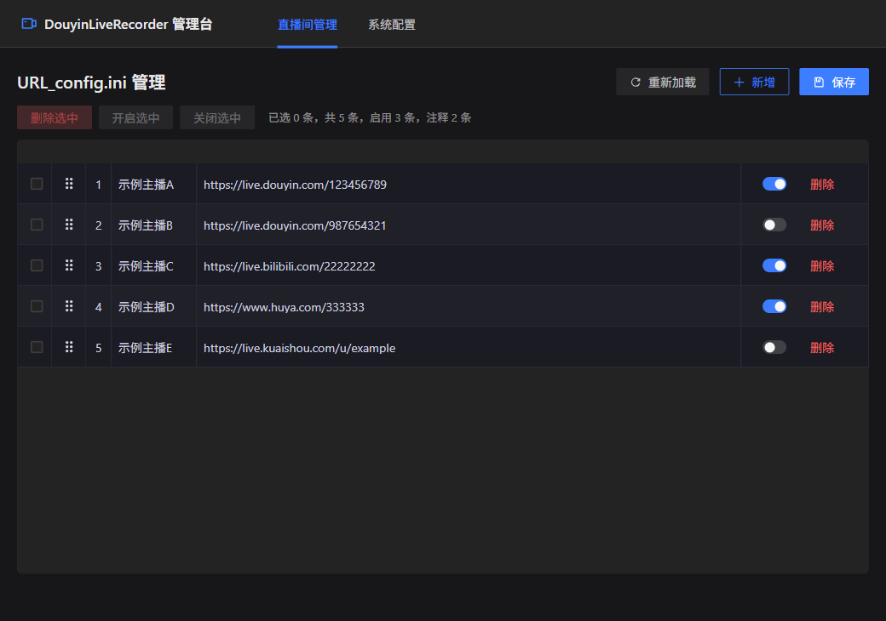
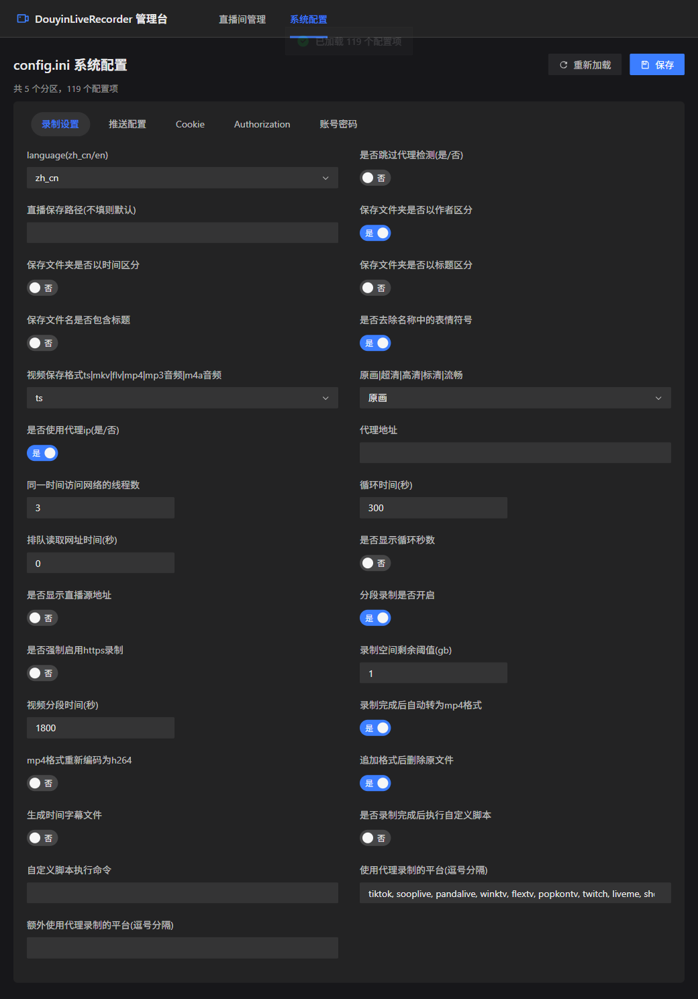

# DouyinLiveRecorder （含 Web 配置管理台）

> 本仓库 Fork 自 [**ihmily/DouyinLiveRecorder**](https://github.com/ihmily/DouyinLiveRecorder)，在保留原项目全部录制能力的基础上，**新增了一个可视化的 Web 配置管理台**，用于图形化管理 `URL_config.ini`（直播间列表）和 `config.ini`（系统配置）。

---

## 📖 原项目简介

一款**简易**的可循环值守的直播录制工具，基于 FFmpeg 实现多平台直播源录制，支持自定义配置录制以及直播状态推送。支持抖音、TikTok、快手、虎牙、斗鱼、B站、小红书等数十个平台。

- **原项目地址**：https://github.com/ihmily/DouyinLiveRecorder
- **原项目文档 / 支持平台 / 使用方式 / 部署方式**：请前往上方原项目仓库查看完整 README。

录制功能本身的用法与原项目完全一致（配置文件位于 `config/` 目录，程序入口为 `main.py`），本仓库未改变其行为。

---

## ✨ 本项目新增内容：Web 配置管理台

原项目的配置需要手动编辑 `config/URL_config.ini` 和 `config/config.ini` 两个文本文件，容易出错。本项目在 `url_config_manager/` 目录下新增了一套**前后端分离**的 Web 管理界面，让配置可视化、更易维护。

### 功能特性

**直播间管理（`URL_config.ini`）**
- 表格化展示所有直播间记录，读取文件自动解析为结构化数据
- 每行一个开关：打开 = 启用录制，关闭 = 注释该行（`#`），与原项目的注释语义一致
- 支持新增（弹窗填写 URL）、删除（二次确认）、拖拽排序、复选框批量启用/关闭/删除
- 所有改动先在前端暂存，点「保存」才写回文件

**系统配置（`config.ini`）**
- 按分区（录制设置 / 推送配置 / Cookie / Authorization / 账号密码）分 Tab 展示
- 根据配置项类型自动选用控件：开关（是/否）、下拉（画质/格式/语言）、数字输入、密码框、Cookie 多行文本等
- 保存时**原位更新**——只替换对应值，完整保留原文件的注释、空行与结构，不影响 `main.py` 读取

**其他**
- 跟随操作系统自动切换亮色 / 暗色主题
- 顶栏导航布局，方便后续扩展更多管理页面

### 技术栈

| 层 | 技术 |
|---|---|
| 后端 | Python + Flask（读取/写回 ini 文件，提供 REST 接口） |
| 前端 | Vue 3 + TypeScript + Vite + Vue Router |
| UI | Arco Design Vue（按需引入） + [stk-table-vue](https://github.com/xyy94813/stk-table-vue)（高性能表格） |

### 运行截图

**直播间管理**



**系统配置**



---

## 🚀 快速开始（Web 管理台）

> 前提：已按原项目说明准备好 Python 环境，并在 `config/` 下存在 `URL_config.ini` 与 `config.ini`。

### 方式一：随主程序一体启动（推荐）

前端构建产物已输出到 `url_config_manager/backend/static/`，Flask 会直接提供这些静态页面，因此**无需单独启动前端服务**，管理台已集成进 `main.py`：

```bash
pip install -r url_config_manager/backend/requirements.txt
python main.py
```

启动录制程序后会输出一行日志 `Web 配置管理台已启动: http://127.0.0.1:5000`，浏览器访问该地址即可使用（管理台在后台守护线程运行，不影响录制主流程）。

> 若修改了前端代码，需重新构建以更新 `backend/static/`：
>
> ```bash
> cd url_config_manager/frontend
> npm install
> npm run build     # 先执行 vue-tsc 类型检查再打包，产物输出到 ../backend/static
> ```

### 方式二：前后端分离开发模式

适合需要调试前端、使用 Vite 热更新的场景：

```bash
# 终端 1：后端
cd url_config_manager/backend
pip install -r requirements.txt
python app.py            # http://127.0.0.1:5000

# 终端 2：前端开发服务器
cd url_config_manager/frontend
npm install
npm run dev              # http://localhost:5173（/api 已代理到后端）
```

### 后端接口

| 方法 | 路径 | 说明 |
|---|---|---|
| GET | `/api/config` | 读取 `URL_config.ini`，解析为 JSON |
| POST | `/api/config` | 写回 `URL_config.ini` |
| GET | `/api/app-config` | 读取 `config.ini`，按分区解析为 JSON |
| POST | `/api/app-config` | 原位写回 `config.ini` |

---

## 📁 目录结构（新增部分）

```
url_config_manager/
├── backend/
│   ├── app.py            # Flask 服务：读写配置 + 提供静态页面 + run_server()
│   ├── requirements.txt
│   └── static/           # 前端构建产物（vite build 输出，随 Flask 一起提供）
├── frontend/
│   ├── src/
│   │   ├── App.vue                 # 顶栏布局 + 路由出口
│   │   ├── main.ts
│   │   ├── router/index.ts         # 路由（直播间管理 / 系统配置）
│   │   ├── types.ts                # 共享类型定义
│   │   ├── composables/useTheme.ts # 跟随系统的亮/暗色主题
│   │   ├── views/
│   │   │   ├── UrlConfigView.vue    # 直播间管理页（表格）
│   │   │   └── AppConfigView.vue    # 系统配置页（表单）
│   │   └── components/
│   │       └── ActionCell.vue       # 表格操作列（开关 + 删除）
│   ├── package.json
│   └── vite.config.ts
└── screenshots/          # README 截图
```

---

## 📄 License

本项目遵循原项目的开源协议，详见 [LICENSE](LICENSE)。原始录制功能版权归 [ihmily/DouyinLiveRecorder](https://github.com/ihmily/DouyinLiveRecorder) 所有。
